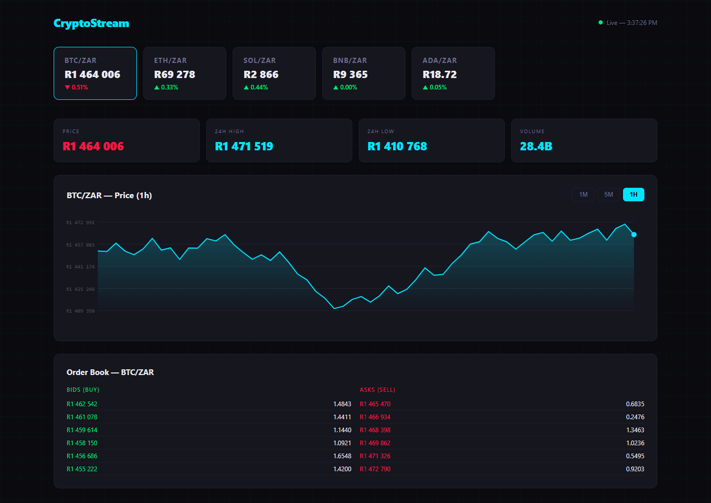

# 📊 Real-Time Crypto Dashboard

> **Role:** Junior Frontend Developer &nbsp;|&nbsp; **Stack:** HTML5 · CSS3 · Vanilla JS · Canvas API

A fully client-side cryptocurrency dashboard that simulates live market data — built with zero dependencies using only native browser APIs.

---

## 🚀 Live Preview

!
Click here - https://real-time-crypto-dashboard-iota.vercel.app/

OR

Open `index.html` in any browser — prices update automatically every **1.5 seconds** with a simulated live feed.

---

## ✨ Features

- 📈 **5 cryptocurrency tickers** with real-time price updates
- 🎨 **Animated canvas price chart** with gradient area fill
- 📖 **Live order book** displaying bids and asks
- 📊 **24h stats** — High / Low / Volume at a glance
- ⏱️ **Timeframe selector** — 1M · 5M · 1H
- 🔴 **Pulsing live indicator** for that authentic trading feel
- 📱 **Fully responsive** — mobile-first design

---

## 🔧 Technical Highlights

| Feature | Implementation |
|---|---|
| Real-time simulation | `setInterval` price random walk |
| Price chart | HTML5 Canvas API (zero libraries) |
| Responsive chart | `canvas.width = parentElement.getBoundingClientRect().width` |
| Animations | CSS `@keyframes` for live dot pulse |
| State management | Plain JS object (Zustand-like pattern, no framework) |

---

## 📂 Project Structure

```
realtime_dashboard/
├── index.html    # Complete dashboard (HTML + CSS + Canvas JS)
└── README.md
```

---

## 🖥️ How to View

```bash
git clone https://github.com/Pheeha23/Real-Time-Crypto-Dashboard.git
cd Real-Time-Crypto-Dashboard
open index.html
# Prices update every 1.5 seconds automatically
```

No build step. No dependencies. Just open and go.

---


## 👤 Author

**Pheeha Mangena** — Junior Frontend Developer

*Part of my Frontend Developer Portfolio — built to demonstrate real-time UI, Canvas API proficiency, and responsive design without relying on frameworks.*
